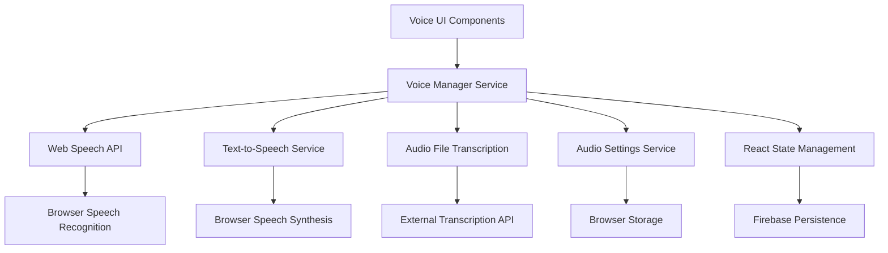

# Voice Integration & Audio Processing Design Document

## Overview

This design document outlines the implementation of comprehensive voice integration and audio processing capabilities for AI Chat Fusion. The feature will leverage modern Web APIs including Web Speech API, MediaRecorder API, and Web Audio API to provide seamless voice input, text-to-speech output, and audio file transcription capabilities.

The design integrates with the existing React 19 + TypeScript architecture, maintaining the current state management patterns while adding new voice-specific services and components. The implementation prioritizes user privacy, accessibility, and cross-browser compatibility.

## Architecture

### High-Level Architecture



### Service Layer Architecture

The voice integration will be implemented as a modular service layer that integrates with the existing AI service architecture:

- **VoiceManager**: Central orchestrator for all voice operations
- **SpeechRecognitionService**: Handles voice-to-text conversion with fallback to external services
- **TextToSpeechService**: Manages text-to-speech playback using Cartesia AI and other premium services
- **AudioTranscriptionService**: Processes uploaded audio files using external transcription APIs
- **VoiceSettingsService**: Manages user preferences and configurations
- **ExternalVoiceService**: Handles integration with Cartesia AI, ElevenLabs, and other premium voice services

### Integration Points

The voice services will integrate with existing components:
- **MessageInput**: Enhanced with voice input button and recording UI
- **ChatHistory**: Enhanced with audio playback controls for AI responses
- **App.tsx**: Updated to handle voice-related state and file uploads
- **Firebase**: Extended to store voice preferences and transcription cache

## Components and Interfaces

### Core Voice Components

#### VoiceInputButton
```typescript
interface VoiceInputButtonProps {
  onTranscription: (text: string) => void;
  disabled?: boolean;
  className?: string;
}
```

A button component that triggers voice recording and displays recording state with visual feedback.

#### AudioPlaybackControls
```typescript
interface AudioPlaybackControlsProps {
  text: string;
  onPlay: () => void;
  onPause: () => void;
  onStop: () => void;
  isPlaying: boolean;
  isPaused: boolean;
  playbackSpeed: number;
  onSpeedChange: (speed: number) => void;
}
```

Controls for playing AI responses as audio with speed adjustment and playback management.

#### VoiceSettingsDialog
```typescript
interface VoiceSettingsDialogProps {
  open: boolean;
  onOpenChange: (open: boolean) => void;
  settings: VoiceSettings;
  onSettingsChange: (settings: VoiceSettings) => void;
}
```

Configuration dialog for voice preferences including language, voice selection, and playback settings.

#### AudioFileUpload
```typescript
interface AudioFileUploadProps {
  onTranscription: (text: string, filename: string) => void;
  onProgress: (progress: number) => void;
  onError: (error: string) => void;
  acceptedFormats: string[];
  maxFileSize: number;
}
```

Drag-and-drop component for audio file uploads with progress tracking and format validation.

### Service Interfaces

#### VoiceManager
```typescript
interface VoiceManager {
  // Speech Recognition
  startRecording(): Promise<void>;
  stopRecording(): Promise<string>;
  isRecording(): boolean;
  
  // Text-to-Speech
  speak(text: string, options?: TTSOptions): Promise<void>;
  stopSpeaking(): void;
  pauseSpeaking(): void;
  resumeSpeaking(): void;
  isSpeaking(): boolean;
  
  // Audio File Processing
  transcribeAudioFile(file: File): Promise<string>;
  
  // Settings
  getSettings(): VoiceSettings;
  updateSettings(settings: Partial<VoiceSettings>): void;
  
  // Capabilities
  isVoiceInputSupported(): boolean;
  isTextToSpeechSupported(): boolean;
  getAvailableVoices(): VoiceOption[];
  getAvailableLanguages(): string[];
  
  // External Services
  getExternalVoiceServices(): ExternalVoiceService[];
  switchVoiceService(service: 'browser' | 'cartesia' | 'elevenlabs' | 'openai'): void;
}

interface VoiceOption {
  id: string;
  name: string;
  language: string;
  gender: 'male' | 'female' | 'neutral';
  service: 'browser' | 'cartesia' | 'elevenlabs' | 'openai';
  premium: boolean;
  preview?: string; // URL to voice sample
}

interface ExternalVoiceService {
  id: 'cartesia' | 'elevenlabs' | 'openai';
  name: string;
  available: boolean;
  voices: VoiceOption[];
  features: {
    realtime: boolean;
    streaming: boolean;
    emotions: boolean;
    customVoices: boolean;
  };
}
```

#### VoiceSettings
```typescript
interface VoiceSettings {
  // Speech Recognition
  language: string;
  continuous: boolean;
  interimResults: boolean;
  recognitionService: 'browser' | 'openai-whisper' | 'google-cloud';
  
  // Text-to-Speech
  voice: string;
  voiceService: 'browser' | 'cartesia' | 'elevenlabs' | 'openai';
  rate: number; // 0.1 to 10
  pitch: number; // 0 to 2
  volume: number; // 0 to 1
  emotion?: 'neutral' | 'happy' | 'sad' | 'excited' | 'calm';
  stability?: number; // 0 to 1 (for ElevenLabs)
  similarity?: number; // 0 to 1 (for ElevenLabs)
  
  // General
  autoPlay: boolean;
  showTranscription: boolean;
  retainAudioFiles: boolean;
  preferPremiumServices: boolean;
  
  // Privacy
  allowDataCollection: boolean;
  cacheTranscriptions: boolean;
  allowExternalServices: boolean;
}
```

## Data Models

### Voice-Related Message Extensions

Extend the existing Message interface to support voice-related metadata:

```typescript
interface Message {
  // ... existing properties
  
  // Voice-specific properties
  hasAudio?: boolean;
  audioUrl?: string;
  transcriptionSource?: 'voice-input' | 'file-upload';
  originalAudioFilename?: string;
  voiceSettings?: Partial<VoiceSettings>;
  audioPlaybackState?: {
    isPlaying: boolean;
    isPaused: boolean;
    currentTime: number;
    duration: number;
  };
}
```

### Audio Processing Models

```typescript
interface AudioTranscriptionRequest {
  file: File;
  language?: string;
  format: 'mp3' | 'wav' | 'm4a' | 'ogg';
  userId?: string;
}

interface AudioTranscriptionResponse {
  success: boolean;
  text?: string;
  confidence?: number;
  language?: string;
  duration?: number;
  error?: string;
  processingTime?: number;
}

interface VoiceRecordingSession {
  id: string;
  startTime: number;
  endTime?: number;
  status: 'recording' | 'processing' | 'complete' | 'error';
  audioBlob?: Blob;
  transcription?: string;
  confidence?: number;
}
```

## Error Handling

### Error Categories and Handling Strategies

#### Browser Compatibility Errors
- **Detection**: Check for Web Speech API and MediaRecorder support on component mount
- **Fallback**: Gracefully hide voice features and show informational messages
- **User Experience**: Maintain full text-based functionality

#### Permission Errors
- **Microphone Access**: Request permissions with clear explanations
- **Denied Permissions**: Show helpful instructions for enabling microphone access
- **Temporary Denials**: Provide retry mechanisms with user guidance

#### Network and Service Errors
- **Transcription Failures**: Implement retry logic with exponential backoff
- **TTS Failures**: Fall back to browser-native speech synthesis
- **File Upload Errors**: Validate file types and sizes before processing

#### Audio Processing Errors
- **Unsupported Formats**: Convert or reject with clear error messages
- **File Size Limits**: Compress or split large files automatically
- **Corrupted Audio**: Detect and handle corrupted audio files gracefully

### Error Recovery Mechanisms

```typescript
interface VoiceErrorHandler {
  handleRecordingError(error: VoiceError): void;
  handleTranscriptionError(error: VoiceError): void;
  handlePlaybackError(error: VoiceError): void;
  handlePermissionError(error: VoiceError): void;
  
  // Recovery strategies
  retryWithFallback<T>(operation: () => Promise<T>, fallbacks: Array<() => Promise<T>>): Promise<T>;
  gracefulDegradation(feature: VoiceFeature): void;
}
```

## Testing Strategy

### Unit Testing

#### Component Testing
- **VoiceInputButton**: Test recording states, permission handling, and user interactions
- **AudioPlaybackControls**: Test playback controls, speed adjustment, and state management
- **VoiceSettingsDialog**: Test settings persistence and validation
- **AudioFileUpload**: Test file validation, drag-and-drop, and progress tracking

#### Service Testing
- **VoiceManager**: Mock Web APIs and test service orchestration
- **SpeechRecognitionService**: Test transcription accuracy and error handling
- **TextToSpeechService**: Test voice synthesis and playback management
- **AudioTranscriptionService**: Test file processing and API integration

### Integration Testing

#### Browser API Integration
- Test Web Speech API integration across different browsers
- Validate MediaRecorder API functionality with various audio formats
- Test Web Audio API integration for advanced audio processing

#### State Management Integration
- Test voice state integration with existing React state management
- Validate Firebase integration for voice settings persistence
- Test voice feature integration with existing chat functionality

### End-to-End Testing

#### User Workflow Testing
- Complete voice input to AI response workflow
- Audio file upload and transcription workflow
- Voice settings configuration and persistence
- Multi-modal interaction (voice + text) workflows

#### Accessibility Testing
- Screen reader compatibility with voice features
- Keyboard navigation for voice controls
- High contrast mode compatibility
- Voice feature accessibility for users with disabilities

### Performance Testing

#### Audio Processing Performance
- Test transcription speed with various file sizes
- Measure memory usage during audio processing
- Test concurrent audio operations
- Validate audio quality and compression

#### Browser Performance Impact
- Test impact on existing chat performance
- Measure memory usage with voice features enabled
- Test performance on mobile devices
- Validate battery usage impact

## Implementation Phases

### Phase 1: Core Voice Input (Requirements 1, 5, 6)
- Implement basic speech recognition using Web Speech API
- Add voice input button to MessageInput component
- Integrate with existing message sending workflow
- Implement privacy controls and permission handling

### Phase 2: Text-to-Speech Playback (Requirements 2, 5)
- Implement text-to-speech service using Web Speech API
- Add audio playback controls to ChatHistory messages
- Implement playback queue management
- Add basic voice settings (voice selection, speed, volume)

### Phase 3: Audio File Transcription (Requirements 3, 5)
- Implement audio file upload component
- Integrate with external transcription service (Web Speech API or cloud service)
- Add progress tracking and error handling
- Support multiple audio formats

### Phase 4: Advanced Settings and Customization (Requirements 4, 6)
- Implement comprehensive voice settings dialog
- Add language selection and voice customization
- Implement settings persistence with Firebase
- Add advanced privacy controls

### Phase 5: Polish and Optimization (All Requirements)
- Implement advanced error handling and recovery
- Add comprehensive testing coverage
- Optimize performance and memory usage
- Add accessibility enhancements

## Technical Considerations

### Browser Compatibility
- **Chrome/Edge**: Full Web Speech API support
- **Firefox**: Limited speech recognition, full synthesis
- **Safari**: Partial support, requires user interaction for synthesis
- **Mobile Browsers**: Varying support, especially for continuous recognition

### Privacy and Security
- All voice processing happens client-side when possible
- External transcription services used only for file uploads
- User consent required for all voice features
- Option to disable voice data retention

### Performance Optimization
- Lazy loading of voice services
- Audio compression for file uploads
- Efficient memory management for audio processing
- Background processing for non-blocking transcription

### Accessibility
- Full keyboard navigation support
- Screen reader announcements for voice states
- Visual indicators for audio activity
- Alternative text input always available